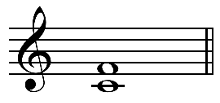
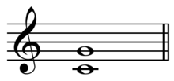
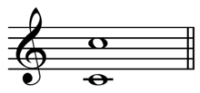
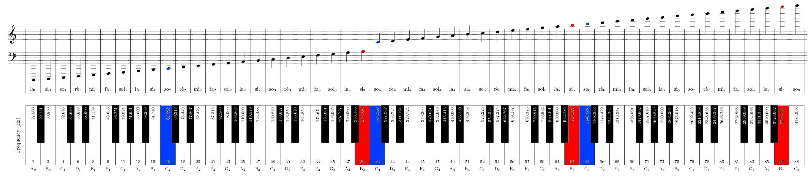

# Eartrainer
This project is being created as a programming project in informatics class supervised by Ms Vazquez in January - March 2018.

The code can be downloaded in the [installation](#installation) section.

Here is are [Time Schedule](#time-schedule).

Jump to the [Milestone II](#milestone-ii-21032018).

These are our [Project Goals](#project-goals).

We try to stick to this [Code of Conduct](#code-of-conduct).

## TODOS
- [x] Initialise Project.
    - [x] Gradle init
    - [x] Git init
    - [x] Copy this readme.
    - [x] Add .gitignore.
    - [x] Add .gitattributes.
    - [x] Add already defined deps.
    - [x] Create predefined directory structure.
    - [x] Write first classes.
    - [x] Write first tests.
    - [x] Push to github.
- [x] Create the Project Dossier for MSI.
    - [x] Add a Project Description 1/4 page.
    - [x] Definition of the Problem
    - [x] Analysis of the Requirements
    - [x] Specifications
    - [x] Draft (UML)
    - [x] Copy Implementation
    - [x] Results and Tests
- [ ] Finish the Project.
    - [x] Write a working interface.
    - [x] Write a working application.
    - [ ] Use threading to play the sound.
    - [ ] Refactor the `logic.Level` class.
    - [ ] Add multiple levels.
    - [ ] Write an info page, where the rules are explained.
    - [ ] Compose the background music. And make it playable in the menu and in the after game screen.
    - [ ] Improve the after game screen by adding a timer.
    - [ ] Make a ranking pop-up window that works locally.
    - [ ] Add Jana & Co's logo.
    - [ ] Add a 'Honourable Mentions' part or something like that.
    - [ ] Improve the overall style using css.
    - [ ] Make sure the file is deployed with a custom JRE version that is then used. This ensures cross-platform handling.
    - [ ] Add Salt and Pepper!!!
- [ ] Create the Project Dossier for MSII.
    - [ ] Write the TODO for this part.
    - [ ] Improve the 'Project Description' part especially the part about the game.
    - [ ] Extend the 'Problem Definition' for the 'Local Ranking' point.
    - [ ] In the 'Requirements Analysis' explicitly say that everything was done in java.
    - [ ] Complete the Specification part for MSII. And keep up the level.
    - [ ] The Draft part should be refactored.
        - [ ] Larger UML diagrams
        - [ ] No Lines going over a description part.
        - [ ] Small description
        - [ ] Add a graphical representation of the whole Application procedure.
    - [ ] Make sure to add additional classes with links.
    - [ ] Write the 'Results and Test' part.
        - [ ] Add a comment with 2-5 lines (possibly more) about how the application was tested.
            - [ ] Maybe make reference to the test part.
            - [ ] What had to be debugged, where did compilation errors occur?
            - [ ] What was easy to implement?
        - [ ] Show the results (9 points!!!)
            - [ ] Add screenshots from the GUI and add descriptions (1-2 Sentences per image).
            - [ ] Additional criterias must be documented too.
    - [ ] Write the 'Discussion and Outlook'.
        - [ ] What have we learnt (> 2 sentences).
        - [ ] Have we planned realistacally?
        - [ ] Explain difficulties (in the group?).
        - [ ] Add a list with possible additions for the game.
    - [ ] Ensure every class fulfills the [Code of Conduct](#code-of-conduct).
    - [ ] Ensure consistent presentation of the document. (No in-topic page breaks).
- [ ] Have a Beer where we celebrate the finished Project!!!
    - [ ] Evaluate over an appropriate location.
    - [ ] Go to the bar and order a beer.
    - [ ] Enjoy!!!

## The Idea
A game based on the game of set. TODO

### The Game
*Set is a real-time card game [...]. The deck consists of 81 cards varying in four features: number (one, two, or three); symbol (diamond, squiggle, oval); shading (solid, striped, or open); and colo[u]r (red, green, or purple). Each possible combination of features (e.g., a card with three striped green diamonds) appears precisely once in the deck. [...] Several Games can be played with these cards, all involving the concept of a set. A set consists of three cards satisfying all of these conditions:*
- *They all have the same number or have three different numbers.*
- *They all have the same symbol or have three different symbols.*
- *They all have the same shading or have three different shadings.*
- *They all have the same colo[u]r or have three different colo[u]rs.*

*[...] Given any two cards from the deck there is one and only one other card that forms a set with them.*

*In the standard Set game, the dealer lays out cards on the table until either twelve are laid down or someone sees a set and calls "Set!". The player who called "Set" takes the cards in the set, and the dealer continues to deal out cards until twelve are on the table. A player who sees a set among the twelve cards calls "Set" and takes the three cards, and the dealer lays three more cards on the table.*

Source: https://en.wikipedia.org/wiki/Set_(game)

### An Example of a Set


### Our Tweaks
However, we do not want to create a clone of this game but rather convert it into something new.
Our idea is to use this notion of a set and apply it to music. 
Instead of having a 4x3 grid where one has to find a set, we will use a simpler version of the game.
In this version two 'cards' already lie on the table. By the rules of set, the third card is clearly determined.

In our version of the game the visual features of colour, number, symbol and shading are replaced by auditive features.
These auditive features are:
 - Which interval is it (out of a predetermined list of three)?
 - Is the lower or the higher note played first or are they played simultaneously?
 - In which range is the interval (high, middle, low)?
 - By which instrument is the interval played (out of a predetermined list of three)?
 
### Level 1 Specifications
In the first level of the game the list of intervals, range and instruments are quite simple. In further levels these features will be adapted in order to achieve a more difficult version.

#### Intervals

The list of intervals to choose from is:
- Perfect fourth 
- Perfect fifth 
- Perfect octave 

(Image source: https://en.wikipedia.org/)

#### Ranges

For the ranges we have taken the range of a piano and cut it roughly in three parts.



(Image source: https://i.stack.imgur.com/MpiRg.png)

The blue keys indicate the start of a range whereas the red keys indicate the end of a range.

The pitches are listed in [Scientific Pitch Notation](https://en.wikipedia.org/wiki/Scientific_pitch_notation).

- The low range spans from the zeroth octave to the second.
(C2-B3)
- The middle range spans from the third octave to the fifth octave.
(C4-B5)
- The high range spans from the sixth to the eighth octave.
(C6-B7)

#### Instruments

The instruments we chose are:
 - Piano
 - Strings
 - Brass

Note that strings and brass are not specific instruments but rather a group of instruments. This is done to achieve the wide range of tones to be played.

#### Order

This is a knob that we can not turn, the default orders are:
- Upwards - meaning the lower note is played before the higher.
- Downwards - meaning the higher note is played before the lower.
- Chordal - both notes are played simultaneously.

#### Overview

Interval | Range | Order | Instrument
---------|-------|-------|-----------
perfect fifth | low (C2 - B3) | upwards | piano
perfect fourth | middle (C4 - B5) | downwards | strings
perfect octave | high (C6 - B7) | at the same time | brass


## Setup

Note that the sources listed here are not necessarily the ones we used in the end. Those are listed in the [Sources](#sources) section.

We use quite a few tools that make development easier.
- [Git and Github](#git-and-github)
- [Gradle Build Tool](#gradle)
- [Testing Library](#testing)
- [GUI](#graphical-user-interface)
- [Further Library](#further-libraries)

### Git and Github
Git is a version management tool. It makes version management a breeze. Github makes distributed working easy.
To get an overview over this tool checkout:
 - [My Bash and Git Cheatsheet](https://github.com/stymphalide/git_bash_cheatsheet/blob/master/cheatsheet.md "git and bash cheatsheet")
 - [A really good git tutorial](http://gitimmersion.com/ "gitimmersion") (I really recommend checking this out)
 - [An introduction to Github's markdown](https://guides.github.com/features/mastering-markdown/ "mastering-markdown") (This file is written in this markdown.)
 - [A Markdown Cheatsheet](https://github.com/adam-p/markdown-here/wiki/Markdown-Cheatsheet "Markdown Cheatsheet")
 - [A Markdown Editor](https://jbt.github.io/markdown-editor/ "markdown editor")

Note: Since Windows and Linux handles line endings differently there has to be some set up in a .gitattributes file.
[Dealing with line endings](https://help.github.com/articles/dealing-with-line-endings/)

### Gradle
A Build tool for our application. Takes the task of compiling the code and running tests away from us. Can also be used to create a `.jar` file. It also sets up a basic project, and most importantly can be used as a plugin in eclipse. This way we can make sure, that the setup of our application 'fits' for the IDE but can still be developed outside.
 - [Gradle Build Tool](https://gradle.org/ "gradle build tool") with tutorials on how to use it
 - [Eclipse Plugin Installation guide](http://www.vogella.com/tutorials/EclipseGradle/article.html "gradle plugin for eclipe") Remark: Make sure to install `gradle 4.4.1` or the corresponding version.
 - [Github source code](https://github.com/gradle/gradle "gradle")
 - [Add dependencies](https://stackoverflow.com/questions/20700053/how-to-add-local-jar-file-dependency-to-build-gradle-file "gradle dependency stackoverflow")
 - [The Maven Architecture](https://maven.apache.org/guides/introduction/introduction-to-the-standard-directory-layout.html)


### Testing
 - [JUnit on Github](https://github.com/junit-team/junit4 "source code") 
 - [Getting started with junit](https://github.com/junit-team/junit4/wiki/Getting-started "getting started with junit")
 - [junit dcoumentation](http://junit.org/junit4/javadoc/latest/ "junit documentation")
 - [Why Testing?](https://www.quora.com/Why-is-testing-code-important "why testing is important") (Note: We are probably only going to do the first category of tests that he describes.)
 - [TDD](https://www.agilealliance.org/glossary/tdd/ "tdd") would be nice if we could actually implement some parts of the test-driven paradigm. (Note: Under time pressure this is not going to work.)

### Graphical User Interface
After the 'coding part' and the testing part we should decide on which libraries to use to accomplish out task. One thing that needs to be covered is the how to make the Graphical User Interface. We are going to use Java's go-to tool, namely javafx.
 - [JavaFX API](https://docs.oracle.com/javase/8/javafx/api/toc.htm "JavaFX API")
 - [JavaFX Tutorial](http://code.makery.ch/library/javafx-8-tutorial/ "JavaFX Tutorial")
 - [Use JavaFX's WebView](https://docs.oracle.com/javafx/2/webview/jfxpub-webview.htm "JavaFX WebView")

### Further Libraries
Since we are going to produce sound in one way or another it is necessary to check out some midi/sound libraries for Java.

Java ships with some integrated libraries to accomplish these tasks:
 - `javax.sound.sampled`
 - `javax.sound.midi`

A higher level library could be jFugue:
 - [jFugueGithub](https://github.com/dmkoelle/jfugue "jfugue/github")
 - [jFugue](http://www.jfugue.org/ "jFugue") A high level midi parser, that take care of most of the dirty details, works out of the box.(?)
 - [Some basic examples](http://www.jfugue.org/examples.html "jfugue examples")
 - [jFugue API](http://www.jfugue.org/doc/index.html "jFugue API")


## Time Schedule

### List of important dates.
- [x] 19.01.2018: Project Goals + Additional Goals defined
- [x] 14.02.2018: [MSI](#milestone-i-14022018)
- [ ] 25.02.2018: [1.0.0 Release](#v100)
- [ ] 18.03.2018: Final Release
- [ ] 21.03.2018: [MSII](#milestone-ii-21032018)

### Short Term Planing #1 (due 'til 26.01.)
- [x] Discuss level design.
- [x] Familiarise oneself with javafx.
- [x] Familiarise oneself with jFugue.
- [x] Define project structure. -> Define rough class structure.
- [x] Implement basic classes.
- [x] Write project description for MSI.
- [x] Create some UML diagrams from the rough project structure.


### Short Term Planing #2 (due 'til 11.02.)
- [x] Write project description for MSI.
- [x] Write Problem definition for MSI.
- [x] Create some UML diagrams from the rough project structure. 
- [x] Copy code into MSI including comments which classes to look at.

### Short Term Planing #3 (due 'til 25.02.)
- [x] Merge all branches correctly.
- [ ] Create the v1.0.0.
- [ ] Start with addditional goals.


## Project Structure
The Project has the basic gradle structure.
The source files i.e. the part that we write is in the ./src/ directory.


### Tree
Make a tree of the project structure.
```
.
├── build.gradle
├── gradle
│   └── wrapper
│       ├── gradle-wrapper.jar
│       └── gradle-wrapper.properties
├── gradlew
├── gradlew.bat
├── lib
│   └── jfugue-5.0.9.jar
├── Readme.md
├── resources
│   ├── app
│   │   ├── app_angelo_runable.zip
│   │   └── app_tobi_runable.zip
│   ├── current_tree.tree
│   ├── descriptions
│   │   └── level_1.txt
│   ├── Eartrainer.png
│   ├── Eartrainer.ucls
│   ├── img
│   │   ├── after_game_screen.png
│   │   ├── Level_1_view.png
│   │   ├── level_1_view_progress.png
│   │   ├── Menu_hover_view.png
│   │   ├── menu_view.png
│   │   ├── perfect_fifth.png
│   │   ├── perfect_fourth.png
│   │   ├── perfect_octave.png
│   │   ├── range_piano_coloured.png
│   │   └── range_piano.png
│   └── UML_Logic.png
├── settings.gradle
└── src
    ├── main
    │   └── java
    │       ├── App.java
    │       ├── logic
    │       │   ├── Card.java
    │       │   ├── Level1.java
    │       │   ├── Level.java
    │       │   ├── Question.java
    │       │   └── Sound.java
    │       └── view
    │           ├── Level.java
    │           └── Menu.java
    └── test
        └── java
            ├── AppTest.java
            ├── logic
            │   └── SoundTest.java
            └── viewTest
                └── MenuTest.java

16 directories, 36 files

```

## Installation
Right now the only way to use our app is by building it from source.

### Prerequisites
You need to have gradle installed:
[Gradle Build Tool](https://gradle.org/ "gradle build tool")

### Download
Download an exectuable .jar archive [here](somerepository "exectuable") (Not available yet.)

[//]: # (@TODO: Add an executable .jar with its own JRE.)

Or clone this repository

    git clone https://github.com/stymphalide/eartrainer.git

    cd eartrainer
    gradle build # Compiles all classes and runs all tests
    gradle run # Runs the compiled classes


## Project Goals
 - Desktop-App: Eartrainer
 - Inspired by the game "Set", whereby the visual features are replaced by auditive ones.
 - There is a menu screen where the level can be chosen.
 - There is an in-game screen where the magic happens. 
 - There is an after-game screen where the results are shown.

### Additional Goals
 - Multiple levels
 - There is an info page where the exact rules are outlined.
 - Add (compose) background music in the menu and after-game-screen.

#### Extended Additional Goals
 - Local ranking system

### Required Libraries
 
 - jFugue
 - javaFX
 - some random stuff
 - javax.sound.sampled

## Task Management
Task | Person
-----|-------
Level Design | Both
Dependency Management | Angelo
Tests | Both
Interface | Angelo
JavaFX | Angelo
Gradle Build | Angelo
jFugue | Tobias
Game Logic | Tobias
Music Theory | Tobias
Music Composition | Tobias

## Code of Conduct
Based on the requirements in the Milestone I file.

- Main-Class is commented as follows:


```java
/*
    Date: 20.01.2018
    Project Name: Eartrainer
    Names: Angelo Birrer G4L and Tobias Seefeld G4L
    Main Sources: JavaFX API
    Code Management: logic: Tobias Seefeld G4L | view: Angelo Birrer G4L
*/
```


- Every Class has a `/*classdoc*/` comment where the usage of the class is described.
- After every import there is a `// What is this for` comment
- Important variables (Probably instance variables of the class) are explained
- Important methods (Those that are used by the main method?) are explained
- Larger code fragments such as (Nestings, loops, constructors etc.)
- Copy-pasted stackoverflow code has to be marked.
- Larger imported code bits are stated on top of the class with source. (I hope this will not happen too often.)
- The code should be slim! (Refactoring is a crucial part of TDD!)

## Sources
Everything we stumble upon doing research comes into this part.
### JavaFX
- [JavaFX Guide](https://javabeginners.de/Frameworks/JavaFX/index.php)
- [JavaFX Wikipedia](https://de.wikipedia.org/wiki/JavaFX)
- [JavaFX API](https://docs.oracle.com/javase/8/javafx/api/toc.htm "JavaFX API")
- [FXML Sources](https://docs.oracle.com/javafx/2/fxml_get_started/jfxpub-fxml_get_started.htm)
- [100 JavaFX Tutorials](http://javafxjq.blogspot.ch)
- [How to create multiple scenes and switch between scenes in JavaFX](http://www.learningaboutelectronics.com/Articles/How-to-create-multiple-scenes-and-switch-between-scenes-in-JavaFX.php)
-[Hover Effect Over Icon](https://stackoverflow.com/questions/20143548/hover-effect-over-icon)
- [ArrayList to VarArgs](https://stackoverflow.com/questions/9863742/how-to-pass-an-arraylist-to-a-varargs-method-parameter)

### JFugue
- [Some basic examples](http://www.jfugue.org/examples.html "jfugue examples")
- [Compose music like a pro rapid music programming with java jfugue](https://www.techrepublic.com/article/compose-music-like-a-pro-rapid-music-programming-with-java-jfugue/)
- [Main JFugue Source](ftp://ftp.cs.utexas.edu/pub/novak/cs315/jfugue-chapter2.pdf)

### Others
- [File API](https://docs.oracle.com/javase/8/docs/api/java/io/File1.html)
- [IOException API](https://docs.oracle.com/javase/8/docs/api/java/io/IOException.html)
- [FileUtils API](https://commons.apache.org/proper/commons-io/javadocs/api-2.5/org/apache/commons/io/FileUtils.html)
- [How to Catch Exceptions](https://stackoverflow.com/questions/8707906/unreported-exception-java-io-ioexception-must-be-caught-or-declared-to-be-throw)

## Milestones
### Milestone I (14.02.2018)
- src-directory
- [pdf](https://docs.google.com/document/d/11oOIbdYNdyYFIZrn3Ub0UFDf7-bSwdoFziUbVNsw0D0/edit?usp=sharing)
- [Milestone I Vazquez](http://www.vazquez-informatik.ch/files/AKSA_ProgProjLE1_MilestoneI.pdf "milestone1")
- Email: (martivazquez@hotmail.com)

### Milestone II (21.03.2018)
- src-directory
- [pdf](https://docs.google.com/document/d/1AZxzqGgnjF5-mWFIIcZr7S34lyCxhZnmstM7S3sX20M/edit?usp=sharing)
- [Milestone II Vazquez](http://www.vazquez-informatik.ch/files/AKSA_ProgProjLE1_MilestoneII.pdf "milestone2")
- Email: (martivazquez@hotmail.com)


## Releases
### v0.8.0
The reference for MSI.
### v1.0.0
Completion of the basic features described in the [Project Goals](#project-goals).

## License
To be determined

[//]: # (@TODO: License that important??)
